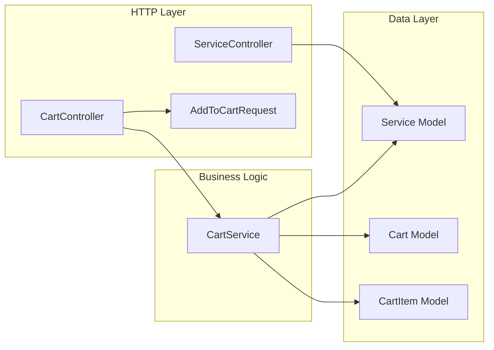

# ZE-Commerce — Backend Logic Reference

> Laravel 13 · Inertia.js 3 · Clean Architecture  
> All routes registered, self-check passed (8/8) ✅

---

## Architecture Overview



**Controllers are slim.** All price calculation, cart resolution, and item management lives in `CartService`. Controllers only handle HTTP concerns (request validation, response formatting).

---

## Files Created

| File | Role |
|------|------|
| [CartService.php](file:///d:/projects/ZE-Commerce/app/Services/CartService.php) | Business logic — cart resolve, add/remove items, price calculation, guest merge |
| [AddToCartRequest.php](file:///d:/projects/ZE-Commerce/app/Http/Requests/AddToCartRequest.php) | Form request — validates `service_id` + `addons[]` structure |
| [ServiceController.php](file:///d:/projects/ZE-Commerce/app/Http/Controllers/ServiceController.php) | `index()` with category filter, `show()` by slug |
| [CartController.php](file:///d:/projects/ZE-Commerce/app/Http/Controllers/CartController.php) | `index()`, `store()`, `destroy()` — delegates to CartService |
| [web.php](file:///d:/projects/ZE-Commerce/routes/web.php) | Route definitions (updated) |

---

## Routes

| Method | URI | Name | Controller | Auth? |
|--------|-----|------|------------|-------|
| `GET` | `/services` | `services.index` | `ServiceController@index` | No |
| `GET` | `/services/{slug}` | `services.show` | `ServiceController@show` | No |
| `GET` | `/cart` | `cart.index` | `CartController@index` | No (guest sessions) |
| `POST` | `/cart` | `cart.store` | `CartController@store` | No (guest sessions) |
| `DELETE` | `/cart/{cartItem}` | `cart.destroy` | `CartController@destroy` | No (guest sessions) |

---

## CartService API

| Method | Purpose | Notes |
|--------|---------|-------|
| `resolveCart(Request)` | Get/create active cart | User ID for auth, session ID for guests |
| `addItem(Request, serviceId, addons?)` | Add service to cart | Snapshots price, prevents duplicates |
| `removeItem(Request, cartItemId)` | Remove item | Scoped to caller's cart — returns `bool` |
| `getCartDetails(Request)` | Full cart + items + totals | Eager-loads `items.service` |
| `calculateTotals(Cart)` | Compute subtotal/addons/grand | Breaks down service prices vs add-on prices |
| `mergeGuestCart(Request)` | Post-login guest→user merge | Avoids duplicate services, cleans guest cart |

---

## Price Calculation Logic

```
For each CartItem:
  service_price  = Service->price           (base cost)
  addons_price   = Σ addon.price            (from JSON array)
  price_snapshot = service_price + addons    (stored as price_at_purchase)

Cart Totals:
  subtotal     = Σ service prices (from live Service model)
  addons_total = Σ all add-on prices across items
  grand_total  = subtotal + addons_total
```

---

## Self-Check Results

All 8 tests passed against a live MySQL database:

| # | Test | Result |
|---|------|--------|
| 1 | Guest cart resolution | ✅ Created with session_id |
| 2 | Add item with add-ons | ✅ price_at_purchase = $12,580 (ERP $12,500 + $80 add-ons) |
| 3 | Add item without add-ons | ✅ price_at_purchase = $3,200 (exact service price) |
| 4 | Duplicate prevention | ✅ Same item returns existing record, count stays 2 |
| 5 | Multi-item totals | ✅ sub=$15,700, add-ons=$80, grand=$15,780 |
| 6 | Remove item | ✅ Item deleted, count drops to 1 |
| 7 | Remove non-existent item | ✅ Returns `false` gracefully |
| 8 | getCartDetails structure | ✅ Returns `{cart, items, totals}` |

---

## Response Formats

### `CartController@store` — `201 Created`
```json
{
  "message": "'Custom ERP System' added to cart.",
  "item": { "id": 1, "cart_id": 1, "service_id": 1, "addons": [...], "price_at_purchase": "12580.00", "service": {...} },
  "totals": { "items_count": 1, "subtotal": 12500.00, "addons_total": 80.00, "grand_total": 12580.00 }
}
```

### `CartController@destroy` — `200 OK`
```json
{
  "message": "Item removed from cart.",
  "totals": { "items_count": 0, "subtotal": 0, "addons_total": 0, "grand_total": 0 }
}
```

### `CartController@index` (JSON via `Accept: application/json`)
```json
{
  "cart": { "id": 1, "user_id": null, "session_id": "...", "status": "active" },
  "items": [ { "id": 1, "service": {...}, ... } ],
  "totals": { "items_count": 1, "subtotal": 12500.00, "addons_total": 80.00, "grand_total": 12580.00 }
}
```
